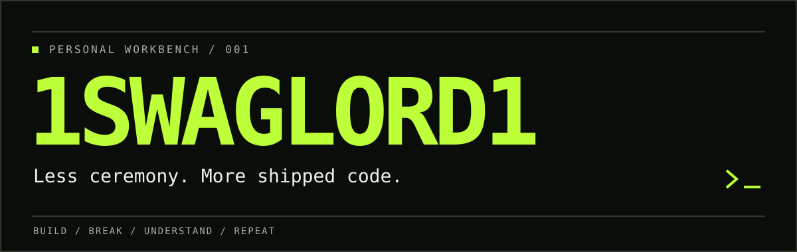

<p align="center">
  
</p>

I like my tools sharp, my feedback loops short, and my abstractions on probation.

Currently poking at AI coding tools, model routing, and the machinery behind them.

### /workbench

| Project | What's on the bench |
| :--- | :--- |
| [Jev-routewise](https://github.com/1SwagLord1/Jev-routewise) | My fork of **jev-router** — task-aware model routing for Claude Code. |
| [claw-code](https://github.com/1SwagLord1/claw-code) | My fork of **claw-code** — exploring the coding-agent harness. |

### /defaults

```text
build something real
find the boring solution
delete the extra layer
repeat
```

<sub>High standards. Low tolerance for boilerplate. Questionable username.</sub>
